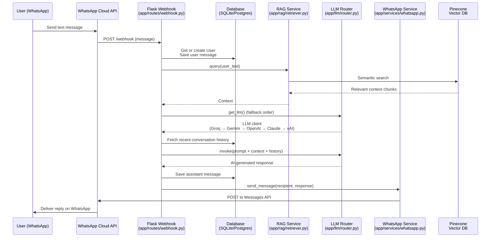

# 🤖 WhatsApp AI Assistant

[](https://python.org)
[](https://flask.palletsprojects.com)
[](https://python.langchain.com)
[](https://pinecone.io)
[](https://developers.facebook.com/docs/whatsapp/cloud-api)
[](https://docker.com)
[](https://opensource.org/licenses/MIT)

[](https://snippe.me/pay/support-cleven)

A production-ready, extensible WhatsApp AI assistant powered by **Retrieval-Augmented Generation (RAG)**, multi-LLM intelligent routing with automatic fallbacks, and persistent conversation memory using SQLAlchemy.

**Free core** for everyone + **paid Pro upgrades** for CRM & advanced app integrations.

Built with Flask, LangChain, Pinecone, and the official WhatsApp Cloud API.

**Current status:** v1.0.0 — Production-ready professional release (1000+ commits)

---

## ✨ Key Features

- 📱 **Full WhatsApp Cloud API Integration** — Send/receive messages via webhooks
- 🧠 **RAG with Pinecone** — Upload your PDFs/TXTs and get accurate, grounded answers
- 🔀 **Smart LLM Router** — Automatic fallback: Groq → Google Gemini → OpenAI → Anthropic Claude (xAI support ready)
- 💾 **Persistent Memory** — Full conversation history per user stored in database
- 🐳 **Dockerized** — One-command deployment with docker-compose
- 🔧 **Easy Knowledge Ingestion** — `ingest_docs.py` script for your documents
- 📊 **Dashboard** — Clean web UI with Free vs Pro highlights + sponsor links
- 🛡️ **Production-Ready Config** — Environment-based config, safe defaults

---

## 🚀 Pro / Enterprise Features

The open-source version is powerful for individuals, small teams, and prototypes.

**Pro features** (available via paid license / custom development) include:

- 🔗 **CRM Integrations**
  - HubSpot, Salesforce, Pipedrive, Zoho, and custom CRMs
  - Automatic lead/contact sync, conversation logging, and deal stage updates directly from WhatsApp chats

- 🔌 **App & Workflow Integrations**
  - Slack, Microsoft Teams, Google Sheets, Notion
  - Zapier / Make.com / n8n webhooks for no-code automations
  - Custom REST API connectors and internal tool integrations
  - Calendar booking, payment gateways (Stripe, etc.), and ticketing systems

- 📈 **Advanced Capabilities**
  - Analytics dashboard & conversation insights
  - Multi-number / team inbox support
  - Priority support + SLA
  - Custom LLM fine-tuning or private model hosting
  - On-premise / VPC deployment options
  - White-labeling and branding removal

For Pro licensing, custom integrations, or enterprise deployment, please contact us directly (see [Contact](#-contact) section).

You can also support the free project on [Snippe](https://snippe.me/pay/support-cleven).

> These capabilities are **not included** in the free open-source distribution. They are offered separately as professional services or paid upgrades.

---

## 📋 Table of Contents

- [Quick Start](#-quick-start)
- [Key Features](#-key-features)
- [Pro / Enterprise Features](#-pro--enterprise-features)
- [Architecture](#-architecture)
- [Configuration](#-configuration)
- [Usage](#-usage)
- [Project Structure](#-project-structure)
- [Development](#-development)
- [Deployment](#-deployment)
- [Contributing](#-contributing)
- [Support](#-support-this-project)
- [Roadmap](#-roadmap)
- [Contact](#-contact)
- [License](#-license)

---

## 🚀 Quick Start

### Prerequisites
- Python 3.10+
- Docker & Docker Compose (recommended)
- Pinecone account + index
- WhatsApp Business Account + Cloud API access (Meta for Developers)
- At least one LLM API key (Groq recommended for speed/cost)

### 1. Clone the repository

```bash
git clone https://github.com/cleven12/whatsapp-ai-assistant.git
cd whatsapp-ai-assistant
```

### 2. Setup environment

```bash
cp .env.example .env
```

Edit `.env` with your credentials.

### 3. Start with Docker (recommended)

```bash
docker compose up --build
```

App will be available at http://localhost:5000

### 4. (Optional) Local run without Docker

```bash
python -m venv venv
source venv/bin/activate
pip install -r requirements.txt
flask run
```

---

## 🏗️ Architecture

The core flow is simple and easy to follow (visualized below):

> 💡 **Tip**: This diagram shows exactly what happens from the moment a user sends a WhatsApp message until they receive a reply.



**Key Components:**

- `app/services/whatsapp.py` — WhatsApp send API wrapper
- `app/llm/router.py` — Resilient LLM provider selection with automatic fallback
- `app/rag/retriever.py` — Semantic search over your documents (Pinecone + HuggingFace embeddings)
- `app/models/` — SQLAlchemy models (`User` + `Message`) for persistent memory
- `ingest_docs.py` — Batch document ingestion pipeline into Pinecone
- `process_user_message()` in webhook — Core orchestration (RAG + LLM + Memory)

---

## ⚙️ Configuration

All configuration lives in `.env` (see `.env.example`).

### Required Variables

| Variable | Description |
|----------|-------------|
| `WHATSAPP_TOKEN` | Permanent access token from Meta |
| `WHATSAPP_PHONE_NUMBER_ID` | From WhatsApp Cloud API setup |
| `WHATSAPP_VERIFY_TOKEN` | Your custom verification string |
| `DATABASE_URL` | e.g. `sqlite:///instance/database.db` or Postgres URI |
| `PINECONE_API_KEY` | Your Pinecone API key |
| `PINECONE_INDEX_NAME` | Usually `whatsapp-rag` |

### LLM Keys (at least one)

- `GROQ_API_KEY`
- `GOOGLE_API_KEY`
- `OPENAI_API_KEY`
- `ANTHROPIC_API_KEY`
- `XAI_API_KEY`

Set up your Pinecone index (384 dim, cosine) using:

```bash
python setup_pinecone.py
```

Ingest your knowledge base:

```bash
mkdir -p uploads
# Put .txt or .pdf files into uploads/
python ingest_docs.py
```

---

## 💬 Usage

1. Configure webhook URL in Meta App Dashboard:
   `https://your-domain.com/webhook/`

2. Send any message to your WhatsApp number.

3. The assistant will:
   - Store the user message
   - Retrieve relevant RAG context
   - Query best available LLM
   - Store assistant reply
   - Reply on WhatsApp

Example interaction flow is handled automatically in `process_user_message()`.

---

## 📁 Project Structure

```
.
├── app/
│   ├── __init__.py          # App factory
│   ├── config.py            # Centralized config
│   ├── models/              # SQLAlchemy models
│   ├── llm/
│   │   └── router.py        # Multi-LLM fallback
│   ├── rag/
│   │   └── retriever.py     # Pinecone RAG
│   ├── routes/
│   │   ├── webhook.py
│   │   └── dashboard.py
│   └── services/
│       └── whatsapp.py
├── static/                  # Frontend assets
├── templates/               # Dashboard HTML (Jinja)
├── uploads/                 # (gitignored) Documents for RAG
├── examples/                # Sample knowledge documents
├── ingest_docs.py
├── setup_pinecone.py
├── Makefile                 # make run | docker-up | ingest | test
├── app.py
├── Dockerfile
├── docker-compose.yml
├── requirements.txt
├── ROADMAP.md
└── README.md
```

---

## 🛠️ Development

### Quick Commands

Use the Makefile for convenience:

```bash
make run          # Start local Flask dev server
make docker-up    # Build & run with Docker
make ingest       # Ingest documents from uploads/
make setup        # Create Pinecone index
make test         # Run tests
```

### Run tests

```bash
make test
# or
pytest
```

### Code quality

Consider adding:
- ruff / black for formatting
- mypy

### Database migrations

```bash
flask db init
flask db migrate -m "init"
flask db upgrade
```

---

## 🚢 Deployment

### Docker (Production)

Update docker-compose or use your platform (Railway, Render, Fly.io, AWS etc).

Recommended production settings:
- Use Postgres for `DATABASE_URL`
- Set `FLASK_ENV=production`
- Strong `SECRET_KEY`
- Gunicorn workers tuned

### Webhook Security

Always verify `WHATSAPP_VERIFY_TOKEN` and consider IP allow-listing from Meta.

---

## 🤝 Contributing

We welcome contributions!

1. Fork the repo
2. Create feature branch (`git checkout -b feat/amazing-feature`)
3. Commit your changes (`git commit -m 'feat: add amazing feature'`)
4. Push and open a Pull Request

See [CONTRIBUTING.md](CONTRIBUTING.md) for details.

---

## 🗺️ Roadmap

See [ROADMAP.md](ROADMAP.md) for the full plan, including:

- **Free tier improvements** (community contributions welcome)
- **Pro/Enterprise features** (CRM integrations, advanced app connectors, analytics, white-labeling, etc.)

The free core stays powerful and open source. Paid upgrades unlock business-critical integrations.

---

## 💖 Support This Project

This project is **free and open source**. If it saves you time or helps your business, please support development:

**Sponsor via Snippe** (recommended):
[](https://snippe.me/pay/support-cleven)

Every contribution helps add new features and keep the project maintained. Thank you! ❤️

> 💡 Looking for advanced capabilities? See **[Pro / Enterprise Features](#-pro--enterprise-features)** or contact us via [Email](mailto:clevengodsontech@gmail.com) / [WhatsApp](https://wa.me/255692654000).

---

## 📬 Contact

For **Pro licensing**, enterprise features (CRM integrations, custom app connections), support, or business inquiries:

**Email:** [clevengodsontech@gmail.com](mailto:clevengodsontech@gmail.com)

**WhatsApp:** [+255 692 654 000](https://wa.me/255692654000)

We typically respond within 24 hours.

---

## 📄 License

This project is licensed under the MIT License — see the [LICENSE](LICENSE) file for details.

---

<p align="center">
  Made with ❤️ by <a href="https://github.com/cleven12">Cleven</a><br>
  <a href="mailto:clevengodsontech@gmail.com">clevengodsontech@gmail.com</a> • <a href="https://wa.me/255692654000">+255 692 654 000 (WhatsApp)</a>
</p>
