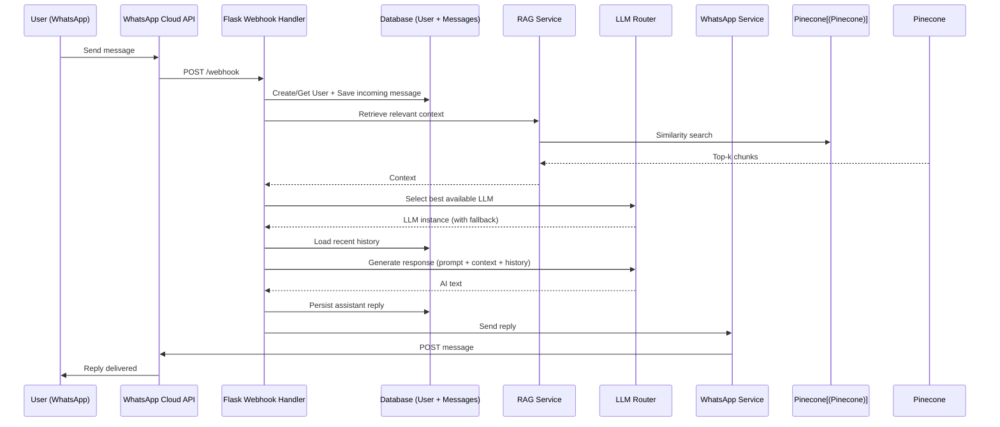

# Architecture Overview

The application follows a clean request/response flow using RAG + LLM with memory.

## Message Flow Diagram

## Design Principles

- **Stateless web process** — All state lives in external services
- **External vector database** — Pinecone for scalable semantic search
- **SQL for conversation memory** — SQLite (dev) or Postgres (prod)
- **Resilient LLM routing** — Automatic fallback across multiple providers

## Core Files

| Component       | File                          | Responsibility                     |
|-----------------|-------------------------------|------------------------------------|
| Webhook         | `app/routes/webhook.py`       | Main orchestration & memory        |
| RAG             | `app/rag/retriever.py`        | Document retrieval from Pinecone   |
| LLM Router      | `app/llm/router.py`           | Provider selection + fallbacks     |
| WhatsApp        | `app/services/whatsapp.py`    | Sending messages via Cloud API     |
| Models          | `app/models/__init__.py`      | User & Message persistence         |
| Ingestion       | `ingest_docs.py`              | Loading documents into vector DB   |

**Note:** Advanced CRM and multi-app integration layers are part of the **paid Pro offering**. See [ROADMAP.md](../ROADMAP.md) and the Pro section in the main README.

